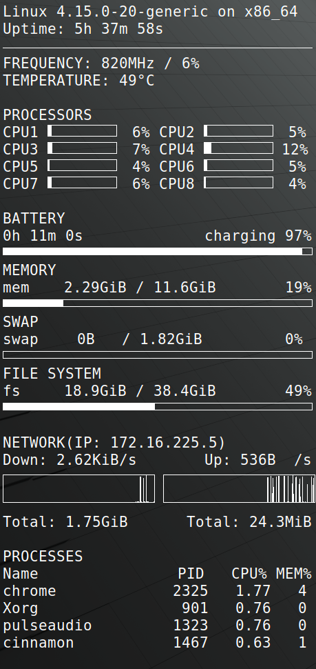

Linux tips
==========

Contents
--------

- [ssh](#ssh)
    - [Generate ssh key](#generate-ssh-key)
    - [Set ssh alive](#set-ssh-alive)
    - [Set ssh alias](#set-ssh-alias)
    - [ssh without password](#ssh-without-password)
- [git](#git)
- [Vim](#vim)
    - [Vim setting](#vim-setting)
    - [Executing python code from Vim](#executing-python-code-from-vim)
- [apt mirror](#apt-mirror)
- [terminal shortcut](#terminal-shortcut)
- [docker](#docker)
    - [Show docker images](#show-docker-images)
    - [Show all containers](#show-all-containers)
    - [Enter the container](#enter-the-container)
- [ncdu](#ncdu)
    - [List recursive file sizes of files and directories in a directory](#list-recursive-file-sizes-of-files-and-directories-in-a-directory)
- [ethtool](#ethtool)
    - [Change ethernet connection speed](#change-ethernet-connection-speed)
- [virtualenv](#virtualenv)
    - [Install virtualenv](#install-virtualenv)
    - [Create a virtualenv](#create-a-virtualenv)
- [The srt subtitle file is garbled](#the-srt-subtitle-file-is-garbled)
    - [iconv](#iconv)
- [tlp](#tlp)
    - [Install tlp and reboot](#install-tlp-and-reboot)
    - [Confirm that the service is enabled](#confirm-that-the-service-is-enabled)
- [Linux Mint System Setting not showing](#linux-mint-system-setting-not-showing)
    - [Issue](#issue)
    - [Downgrade pillow version](#downgrade-pillow-version)
- [conky](#conky)
    - [Install conky](#install-conky)
    - [Generate conky configuration template](#generate-conky-configuration-template)
    - [Custom configuration](#custom-configuration)

Nvidia drive
------------

### nvidia-smi not work

    $ nvidia-smi
    NVIDIA-SMI has failed because it couldn't communicate with the NVIDIA driver. Make sure that the latest NVIDIA driver is installed and running.
    $ sudo prime-select nvidia
    $ sudo prime-select intel
    $ sudo prime-select nvidia
    $ sudo reboot

### add rule to disable nouveau

    $ sudo vim /etc/modprobe.d/blacklist-nvidia-nouveau.conf
    blacklist nouveau
    options nouveau modeset=0
    
### fully remove nvidia driver

    $ sudo apt purge nvidia*
    $ sudo apt purge libnvidia*
    $ dpkg -l | grep -i nvidia | awk '{print $2}' | xargs sudo dpkg -r
    
    # check whether left nvidia file
    $ cd /usr/lib/
    $ find -name "*nvidia*"
    
    $ sudo update-initramfs -u
    $ sudo reboot

cuda and cudnn
--------------

### cuda

Download the cuda runfile to skip the driver installation

### cudnn

    $ tar -xzvf cudnn-*.tgz
    $ sudo cp cuda/include/cudnn.h /usr/local/cuda/include
    $ sudo cp cuda/lib64/libcudnn* /usr/local/cuda/lib64
    $ sudo chmod a+r /usr/local/cuda/include/cudnn.h /usr/local/cuda/lib64/libcudnn*
    
### ldconfig

    $ sudo ldconfig 
    /sbin/ldconfig.real: /usr/local/cuda/lib64/libcudnn.so.x is not a symbolic link

    $ cd /usr/local/cuda/lib64
    $ ls -lha libcudnn*

    $ sudo rm libcudnn.so
    $ sudo rm libcudnn.so.x
    $ sudo ln libcudnn.so.x.y.z libcudnn.so.x
    $ sudo ln libcudnn.so.x libcudnn.so
    
    $ sudo ldconfig

ssh
---

### Generate ssh key

    $ ssh-keygen -t rsa -C <email> -b 4096
    
### Set ssh alive

Add follow command to ~/.ssh/config

    Host *
    ServerAliveInterval 240
    
and

    $ chmod 600 ~/.ssh/config

### Set ssh alias

Add following commands to ~/.ssh/config

    # for proxy
    Host <alias proxy name>
        Hostname <proxy ip>
        User <uname>
        ForwardX11 yes
        ForwardX11Trusted yes
        
    # for server
    Host <alias server name>
        Hostname <server name>
        User <uname>
        ProxyCommand ssh <proxy name> -W %h:%p

### ssh without password

    $ scp ~/.ssh/id_rsa.pub <server_hostname>:~/.ssh/<new_name.pub>
    $ ssh <server_hostname>
    $ cat ~/.ssh/<new_name.pub> >> ~/.ssh/authorized_keys

git
---

    $ git config --global user.name "<name>"
    $ git config --global user.email <email>
    $ git config --global core.editor vim
    $ git config --global alias.ci commit
    $ git config --global alias.st status

Vim
---

### Vim setting

Add follow command to ~/.vimrc

    set tabstop=4
    set shiftwidth=4
    set nu
    set hlsearch
    set smartindent
    set scrolloff=5
    "set expandtab

### Executing python code from Vim

Add follow command to ~/.vimrc

    # FileType python: Triggered when editing a file with a '.py' suffix
    # nnoremap: Only valid in normal mode
    # <buffer>: ?
    # <F9>: keyboard shortcut
    # exec: '!clear; python3 %'
    # <cr>: carriage return, same as enter
    # :help key-notation
    autocmd FileType python nnoremap <buffer> <F9> :exec '!clear; python3 %'<cr>

apt mirror
----------

Save the following commands as foo.sh

    #!/bin/bash

    # replace the mirror as nchc
    LINK=`cat /etc/apt/sources.list | grep main | awk '{ print $2 }' | cut -d'/' -f3 | sed -n '3P'`
    sudo sed -i 's/${LINK}/free.nchc.org.tw/g' /etc/apt/sources.list

and

    $ source foo.sh

terminal shortcut
-----------------

- ctrl + U: Clear **whole** command line.
- ctrl + W: Clear words to the **left** of the cursor
- ctrl + K: Clear words to the **right** of the cursor
- ctrl + L: Clear words **above** the cursor.

docker
------

### Show docker images

    $ docker images

### Show all containers

    $ docker ps -a

### Enter the container

    $ docker exec -e LANG=en_US.UTF-8 -e LC_ALL=en_US.UTF-8 --user <uname> -it <container id> bash

ncdu
----

### List recursive file sizes of files and directories in a directory

    $ ncdu

ethtool
-------

### Change ethernet connection speed

eth0 is the network card name from command `$ ifconfig`

    $ sudo apt-get install ethtool
    $ sudo ethtool -s eth0 speed 100 duplex full

virtualenv
----------

### Install virtualenv

    $ pip3 install -U virtualenv
    
### Create a virtualenv

    $ python3 -m virtualenv -p python3 [name]

The srt subtitle file is garbled
--------------------------------

### iconv

    $ iconv -c -f big5 -t utf8 [old.srt] > [new.srt]

tlp
---

### Install tlp and reboot

    $ sudo apt install tlp
    $ sudo shutdown -r now
    
### Confirm that the service is enabled

    $ sudo systemctl status tlp

Linux Mint System Setting not showing
-------------------------------------

### Issue

    $ cinnamon-settings
    Traceback (most recent call last):
      File "/usr/share/cinnamon/cinnamon-settings/cinnamon-settings.py", line 619, in <module>
        window = MainWindow()
      File "/usr/share/cinnamon/cinnamon-settings/cinnamon-settings.py", line 247, in __init__
        for module in modules:
      File "/usr/share/cinnamon/cinnamon-settings/modules/cs_backgrounds.py", line 5, in <module>
        import imtools
      File "/usr/share/cinnamon/cinnamon-settings/bin/imtools.py", line 623, in <module>
        if Image.VERSION == '1.1.7':
    AttributeError: module 'PIL.Image' has no attribute 'VERSION'
    
### Downgrade pillow version

    $ pip3 install pillow==5.4.0

conky
-----

### Install conky

    $ sudo apt install conky-all
    
### Generate conky configuration template

    $ mkdir -p ~/.config/conky/
    $ conky -C >> ~/.config/conky/conky.conf
    
### Custom configuration

~~~~
conky.config = {
    alignment = 'top_right',
    background = false,
    border_width = 1,
    cpu_avg_samples = 2,
    default_color = 'white',
    default_outline_color = 'white',
    default_shade_color = 'white',
    draw_borders = false,
    draw_graph_borders = true,
    draw_outline = false,
    draw_shades = false,
    double_buffer = true,
    use_xft = true,
    font = 'Monospace:size=12',
    gap_x = 10,
    gap_y = 10,
    minimum_height = 5,
    minimum_width = 5,
    maximum_width = 450,
    net_avg_samples = 2,
    no_buffers = true,
    out_to_console = false,
    out_to_stderr = false,
    extra_newline = false,
    own_window = true,
    own_window_class = 'Conky',
    own_window_type = 'desktop',
    own_window_argb_visual = true,
    own_window_argb_value = 80,
    stippled_borders = 0,
    update_interval = 1,
    uppercase = false,
    use_spacer = 'none',
    show_graph_scale = false,
    show_graph_range = false
}

-- ${color grey}Frequency (in MHz):$color $freq
-- ${font Arial:bold:size=10}${color #3b71a1}PROCESSORS ${color #3b71a1}${hr 2}
-- ${color grey}Uptime:$color $uptime
-- ${scroll 16 $nodename - $sysname $kernel on $machine | }
-- ${color grey}Processes:$color $processes  ${color grey}Running:$color $running_processes
-- ${color #3b71a1}CPU Usage:${color #3b71a1} $cpu% ${cpubar 4}

-- ${color}Name              PID   CPU%   MEM%
-- ${color} ${top name 1} ${top pid 1} ${top cpu 1} ${top mem 1}
-- ${color} ${top name 2} ${top pid 2} ${top cpu 2} ${top mem 2}
-- ${color} ${top name 3} ${top pid 3} ${top cpu 3} ${top mem 3}
-- ${color} ${top name 4} ${top pid 4} ${top cpu 4} ${top mem 4}
-- $hr
--${color}TEMPERATURE
--Core1 ${hwmon 4 temp 2}°C Core2 ${hwmon 4 temp 3}°C 
--Core3 ${hwmon 4 temp 4}°C Core4 ${hwmon 4 temp 5}°C 
--$nodename
--${execi 1000 cat /proc/cpuinfo | grep 'model name' | sed -e 's/model name.*: //'| uniq | cut -c 1-26}
conky.text = [[
$sysname $kernel on $machine
${color}Uptime:${color} $uptime
$hr
${color}FREQUENCY: ${freq}MHz / ${cpu cpu0}%
${color}TEMPERATURE: ${hwmon 4 temp 1}°C

${color}PROCESSORS
CPU1 ${cpubar cpu1 16,100} ${if_match ${cpu cpu1}<10}${offset 10}${endif}${cpu cpu1}% CPU2 ${cpubar cpu2 16,100} ${if_match ${cpu cpu2}<10}${offset 10}${endif}${cpu cpu2}%
CPU3 ${cpubar cpu3 16,100} ${if_match ${cpu cpu3}<10}${offset 10}${endif}${cpu cpu3}% CPU4 ${cpubar cpu4 16,100} ${if_match ${cpu cpu4}<10}${offset 10}${endif}${cpu cpu4}%
CPU5 ${cpubar cpu5 16,100} ${if_match ${cpu cpu5}<10}${offset 10}${endif}${cpu cpu5}% CPU6 ${cpubar cpu6 16,100} ${if_match ${cpu cpu6}<10}${offset 10}${endif}${cpu cpu6}%
CPU7 ${cpubar cpu7 16,100} ${if_match ${cpu cpu7}<10}${offset 10}${endif}${cpu cpu7}% CPU8 ${cpubar cpu8 16,100} ${if_match ${cpu cpu8}<10}${offset 10}${endif}${cpu cpu8}%

${color}BATTERY
${color}${battery_time} $alignr ${battery}
${color}${battery_bar 10}
${color}MEMORY 
mem $alignc $mem / $memmax $alignr $memperc%
${membar 10}
${color}SWAP 
swap $alignc $swap / $swapmax $alignr $swapperc% 
${swapbar 10}
${color}FILE SYSTEM
fs $alignc $fs_used / $fs_size $alignr $fs_used_perc%
${fs_bar 10}

${color}NETWORK(IP: ${addr wlp2s0})
${color}Down: ${downspeed wlp2s0}/s $alignr Up: ${upspeed wlp2s0}/s
${color}${downspeedgraph wlp2s0 40,220} ${upspeedgraph wlp2s0 40,220}
${color}Total: ${totaldown wlp2s0} $alignr Total: ${totalup wlp2s0}

${color}PROCESSES
${color}Name $alignr PID   CPU% MEM%
${color}${top name 1} $alignr ${top pid 1} ${top cpu 1} ${top mem 1}
${color}${top name 2} $alignr ${top pid 2} ${top cpu 2} ${top mem 2}
${color}${top name 3} $alignr ${top pid 3} ${top cpu 3} ${top mem 3}
${color}${top name 4} $alignr ${top pid 4} ${top cpu 4} ${top mem 4}

]]
~~~~

